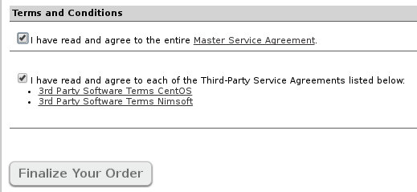
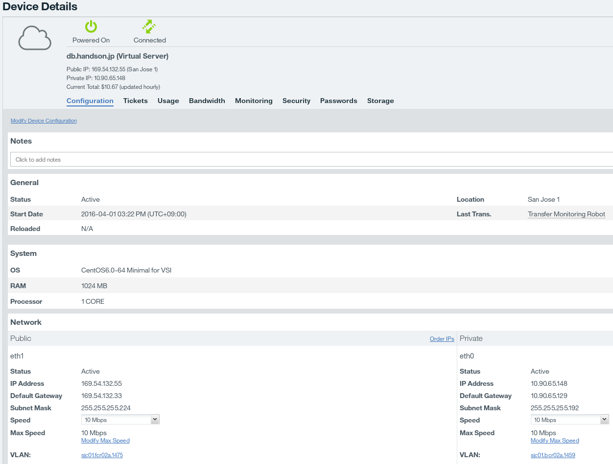
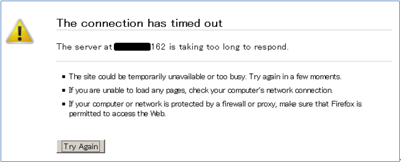
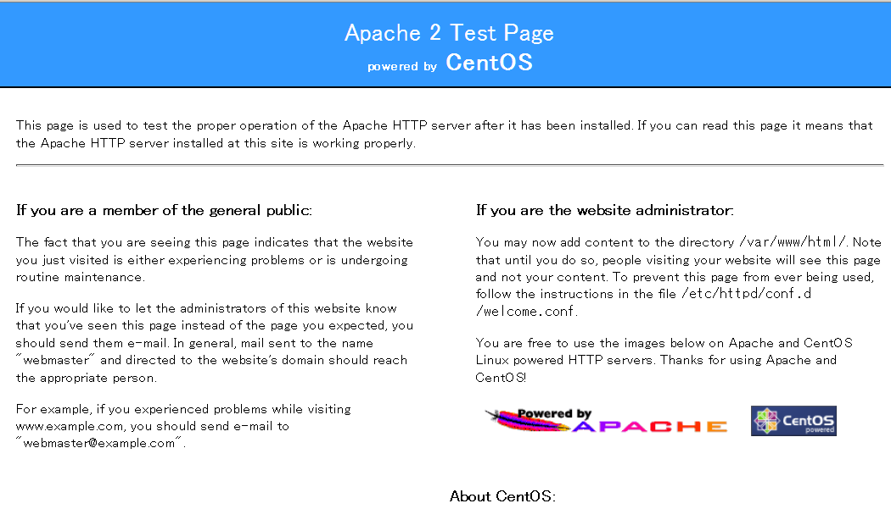
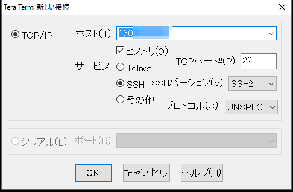
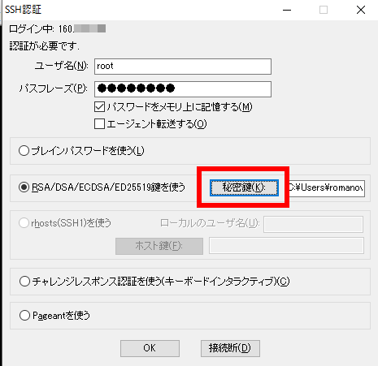
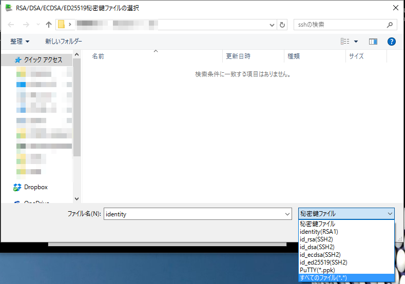
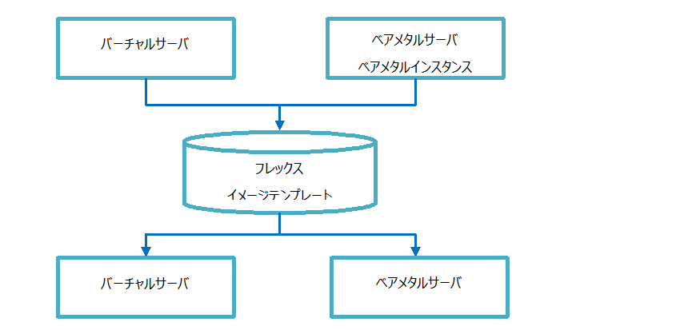
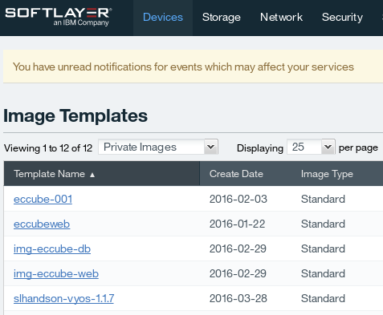

# SoftLayerハンズオン サーバー管理 CentOS 6.x編


## 事前準備

- SoftLayerのアカウントは、事前取得していることを前提にしています。次の「SoftLayer 無料トライアルのご案内」を参照してください。
> 【SoftLayer無料トライアルのご案内<br>】http://www.ibm.com/cloud-computing/jp/ja/softlayer_flow.html

- 当日は取得したアカウントを使用してハンズオンを行います。数十円程度の課金が発生します。
- SoftLayerのアカウントの解約について
全てのリソースがアカウントから削除されますと、お客様のアカウント環境はクローズされ、お手持ちのIDとパスワードでのログインが出来なくなり、事実上ご解約の扱いとなります。ただし、もし同じアカウントIDで再度アカウントを開通されたい場合にはSoftLayerの公式WEBサイト等のチャットにてお申し出頂く事で再度開通させて頂く事も可能です。
課金をされない状態でSoftLayerのアカウントは残しておきたいい場合は、Object Storageのアカウントを作成しておく事をお勧めします。
-	使用するブラウザは、Chromeか、Firefoxをお勧めします。Internet Explorerをお使いの場合、表示されなかったり、表示が崩れたりする事があります。
- 一部、管理ポータルとWebのドキュメント間で用語の不一致がありますが、管理ポータルの大幅な改良や、サービスカテゴリの見直しなどの過渡期にあるためです。


## 管理ポータルへのログイン

SoftLayerの利用は、管理ポータルから操作します。

- https://control.softlayer.com/ にアクセスして、ログインしてください。
  
> - 最初にログオンされた方は、パスワードの変更を促されますので、変更してください。<br>
>- 同じネットワークからのログイン要求で、パスワードを連続3回間違えると、そのネットワークからのログイン要求を30分間遮断しますので、パスワードは慎重にいれてください。<br>
>- ブラウザは、Chrome、Firefoxをお勧めします。Internet Exploreは表示されない場合があります

## 3 仮想サーバーの利用
SoftLayer上では、WindowsやLinux、FreeBSD等様々なサーバOSが動くインスタンスをデプロイして利用することができます。本ハンズオンではCentOS 6.xを利用します。
### 仮想サーバのデプロイ
> 注意 : この作業は課金されます。無料トライアルアカウントユーザの場合、ご注意ください。
無料トライアルでアカウントを取得すると、仮想サーバが既に作成され起動しています。
この最初に作成された仮想サーバは無料で1ヶ月間利用することができます。
今回のハンズオンは、2台目の仮想サーバを作成しハンズオンを行います。
仮想サーバ1台につき、約$0.04/ hour課金されます。
※2014年6月20日現在

#### Order Device
管理ポータルから[Devices]→[Device List]を選んでください。さらに、次の画面から[Order Devices]をクリックしてください。  


製品とサービスのオーダー画面が表示されますので、[Virtual Server (public node)]で、[Hourly]をクリックしてください。  


#### Quantity
サーバの数量を入力してください。  

- 一度に作成できる最大のサーバ数は20台です。


#### Location
ロケーションはSJC01を選択してください。  


#### System Configuration
次は、CPU、RAM、OS、FIRST DISKを設定してください。OS以外はデフォルトでかまいません。OSは、CentOS、Redhat　Enterprise Linux、Ubuntu、Debian、Microsoft Windowsから選択できます。今回はCentOS 6.x - Minimal Install (64 bit)を選択してください。  
  

#### Network operations
今回はすべてデフォルトにしてください。詳細は[Show…]をクリックして確認してください。  
  

#### System Addons
  
今回はすべてデフォルトにしてください。詳細は[Show…]をクリックして確認してください。

#### Storage Addons
すべてデフォルトのままにします。詳細は[Show…]をクリックして確認してください。  
  


#### Service Addons
下記のように選択します。詳細は[Show…]をクリックして確認してください。    
  

最後に、画面一番下の[Continue Your Order]をクリックしてください。    
  

#### Order Summary and Billing
オーダーの概要と請求内容が表示されますので、[Provision Scripts]のセクションまでスクロールしてください。  

  
  
[Provisioning Scripts]では，インストール時に自動で実行するスクリプトを指定できます．ここでは，ファイアウォールの設定を自動で行う為にURL 1に以下のURLを指定します．

    https://raw.githubusercontent.com/kkitase/softlayer-handson/master/scripts/iptables.sh

[Host and Domain Names]のセクションでホスト名とドメイン名を入力してください。このホスト名とドメイン名は実在しない仮の値でかまいません。実際にDNSに対しての操作は行われず、サーバを認識するためだけに用いられます。空欄だとオーダーが確定できません。


> 注意 : 講師から貸与アカウントでハンズオンに参加されている方は下記のネーミングでサーバを作成してください。  
Hostname: “貸与されたアカウント名”  
Domain: ibm.com

サーバにログインするためのパスワードは自動生成されます。SSH鍵認証も利用可能です。
マスターサービスアグリーメントに同意して、[Finalize Your Order]をクリックしてください。


#### オーダー確定(Finalize Your Order)
オーダーが確定すると、次のようにオーダー受け付けた旨のレポート(Your Receipt)が表示されます。同時に、バーチャルサーバ（仮想サーバー）の起動を開始しています。  
オーダー内容を確認後、ウィンドウを閉じてください。
  

### 仮想サーバの確認
メインウインドウにもどり、管理ポータルから[Devices]→[Device List]をクリックしてください。クラウドインスタンスが完全に起動すると、該当サーバのStart Date項目に、サーバ利用開始日付が表示されます。デバイス名の左側に時計のアイコンが表示されている場合はインスタンスの準備作業中です。

  
デバイス名（ここでは、server1.mycompany.com）をクリックすると、詳細情報(Device Details)が表示されます。[Passwords]タブでパスワードを変更しても、実際のサーバには反映されないことに注意してください。今のところ、この情報はサーバと連携していません。パスワードの変更は実際のサーバ内で行ってください。
  
- パスワードが表示されない場合は、画面をリロードしてください。

### 仮想サーバーへのログイン
バーチャルサーバへのログインは、Public IPアドレスに対して行いますので、まずはPublic IPアドレスを確認します。  

管理ポータルから[Devices]→[Device List]をクリックし、サーバ名の横の矢印をクリックします。
  

作成されたサーバのPublic IPアドレスをメモしてください。  
Show Passwordをチェックし、rootのパスワードもメモしてください。

Tera TermやPuTTyなどのSSHクライアントソフトウェアを用いてログインしてください。本資料の手順では、Tera Termを使っています。SSHクライアントソフトウェアをインストールしてない場合は、下記リンクより、Tera Termをインストールしてください。インストール時、「コンポーネントの選択」では「コンパクトインストール」を選択し、それ以外はデフォルトで進めてください。  
Tera Term: http://sourceforge.jp/projects/ttssh2/

  

Tera Termを起動し、先ほどメモしたPublic IPアドレスに接続します。  
  

先ほどメモした、rootパスワードを使用しログインします。
  

特にパスワードが間違っていなければ、次のようにログインできます。
> Last login: Wed Mar 12 04:00:48 2014 from xxx.xxx.xxx.xxx.static.zoot.jp  
[root@server1 ~]#

### ネットワーク構成の確認
#### サーバ起動直後のネットワーク構成
SoftLayerのサーバは標準ではPublic VLANとPrivate VLANに接続された状態で起動します。そしてPublic VLANにはGlobal IPアドレスが、Private VLANにはPrivate IPアドレスが与えられています。  
    
次のようにifconfigコマンドでeth1にはGlobal IPアドレス、eth0にはPrivate IPアドレスが付与されていることを確認します。


    # ifconfig
      eth0      Link encap:Ethernet  HWaddr 06:17:0E:9D:FD:69
                inet addr:10.xxx.xxx.130  Bcast:10.xxx.xxx.191  Mask:255.255.255.192
                inet6 addr: fe80::417:eff:fe9d:fd69/64 Scope:Link
                UP BROADCAST RUNNING MULTICAST  MTU:1500  Metric:1
                RX packets:5326 errors:0 dropped:0 overruns:0 frame:0
                TX packets:2057 errors:0 dropped:0 overruns:0 carrier:0
                collisions:0 txqueuelen:1000
                RX bytes:5908309 (5.6 MiB)  TX bytes:227241 (221.9 KiB)
                Interrupt:246
      eth1      Link encap:Ethernet  HWaddr 06:4A:40:39:35:A7
                inet addr:50.xxx.xxx.98  Bcast:50.xxx.xxx.103  Mask:255.255.255.248
                inet6 addr: fe80::44a:40ff:fe39:35a7/64 Scope:Link
                UP BROADCAST RUNNING MULTICAST  MTU:1500  Metric:1
                RX packets:4108 errors:0 dropped:0 overruns:0 frame:0
                TX packets:3334 errors:0 dropped:0 overruns:0 carrier:0
                collisions:0 txqueuelen:1000
                RX bytes:672487 (656.7 KiB)  TX bytes:663662 (648.1 KiB)
                Interrupt:245
      以下略…

サーバ起動直後では、Linux標準のSoftware firewall (iptables)が起動しており、デフォルトでは、20 (ftpデータ), 21 (ftp制御), 22 (SSH), 25 (SMTP), 53 (DNS), 110 (POP3), 143 (IMAP), 443 (HTTPS), 3306 (MySQL) の通信を許可しています。

#### VLAN構成
管理ポータルから、[Device]→[Device List]→[作成したサーバ]をクリックして、ConfigurationのNetworkカテゴリを確認すると、Public VLANとPrivate　VLAN を確認できます。
  

Public VLANとPrivate　VLANをクリックをすると、それぞれサブネットと関連付けられていることがわかります。

  


#### サブネット構成
Public VLANとPrivate　VLAN それぞれのSubnetsカテゴリに表示されている、サブネットをクリックしてください。標準のサブネットは、次のように構成されています。  

|種類      |レンジ           |個数  |
|:--------:|:---------------:|:----:|
|Public IP |50.xxx.xxx.96/29 |16 IPs|
|Private IP|10.xxx.xxx.126/26|64 IPs|

Public Subnetには、トータルで16個のIPアドレスが与えられています。3つのIPアドレスはシステムが使っており、1つはバーチャルサーバに与えられていることがわかります。空いている4つのIPアドレス（Primary ip for future server only）は、同データセンター内で、次のインスタンスが起動するときに割り当てられます。
  

Private Subnetには、トータルで64個のIPアドレスが与えられています。3つのIPアドレスはシステムが使っており、1つはバーチャルサーバに与えられていることがわかります。空いているIPアドレス（Primary ip for future server only）は、同データセンター内で、次のインスタンスが起動するときに割り当てられます。  
  

### ファイアウォール設定
#### iptablesとは
iptablesは，Linux標準のネットワーク・セキュリティツールです．高機能なファイアウォールとして動作し送受信する通信を柔軟に制御できます．

#### iptablesの起動確認
Provisioning Scriptにより，サーバのデプロイ時に自動的にiptablesがセットアップされています．デフォルトでは、20 (ftpデータ), 21 (ftp制御), 22 (SSH), 25 (SMTP), 53 (DNS), 110 (POP3), 143 (IMAP), 443 (HTTPS), 3306 (MySQL) の通信を許可しています。

    Chain INPUT (policy DROP)
    target     prot opt source               destination
    ACCEPT     all  --  anywhere             anywhere            
    RELATED,ESTABLISHED
    ACCEPT     icmp --  anywhere             anywhere
    ACCEPT     tcp  --  anywhere             anywhere            tcp dpt:ftp-data
    ACCEPT     tcp  --  anywhere             anywhere            tcp dpt:ftp
    ACCEPT     tcp  --  anywhere             anywhere            tcp dpt:ssh
    ACCEPT     tcp  --  anywhere             anywhere            tcp dpt:smtp
    ACCEPT     tcp  --  anywhere             anywhere            tcp dpt:domain
    ACCEPT     udp  --  anywhere             anywhere            udp dpt:domain
    ACCEPT     tcp  --  anywhere             anywhere            tcp dpt:pop3
    ACCEPT     tcp  --  anywhere             anywhere            tcp dpt:imap
    ACCEPT     tcp  --  anywhere             anywhere            tcp dpt:https
    ACCEPT     tcp  --  anywhere             anywhere            tcp dpt:mysql

    Chain FORWARD (policy DROP)
    target     prot opt source               destination

    Chain OUTPUT (policy ACCEPT)
    target     prot opt source               destination
    ACCEPT     all  --  anywhere             anywhere


#### ファイアウォールの設定:接続を許可
iptablesを設定して，外部からSoftLayer上のVMへ接続出来るように設定を行います．SoftLayerのインスタンス上でWebサーバを起動し，ファイアウォールの設定を変更してWebサーバへの接続を許可してください．

    # yum -y install httpd  
    # service httpd start

現在，80(HTTP)との通信は許可されていないため，Webサーバに接続することは出来ません．接続できない事を確認するために，クライアントPCのWebブラウザからPublic IPアドレスに接続します。

    http://<作成したサーバのPublic IP>/

iptablesで80(HTTP)への通信が許可されていないため，接続に失敗してブラウザのエラー画面が表示されます．
  

次に，iptablesの設定で80(HTTP) の通信を許可し，再度Webサーバへ接続します．

    # iptables -A INPUT -p tcp -m tcp --dport 80 -j ACCEPT # ファイアウォールで通信を許可
    # iptables -L
    Chain INPUT (policy DROP)
    target     prot opt source               destination
    ACCEPT     all  --  anywhere             anywhere            state RELATED,ESTABLISHED
    ACCEPT     icmp --  anywhere             anywhere
    ACCEPT     tcp  --  anywhere             anywhere            tcp dpt:ftp-data
    ACCEPT     tcp  --  anywhere             anywhere            tcp dpt:ftp
    ACCEPT     tcp  --  anywhere             anywhere            tcp dpt:ssh
    ACCEPT     tcp  --  anywhere             anywhere            tcp dpt:smtp
    ACCEPT     tcp  --  anywhere             anywhere            tcp dpt:domain
    ACCEPT     udp  --  anywhere             anywhere            udp dpt:domain
    ACCEPT     tcp  --  anywhere             anywhere            tcp dpt:pop3
    ACCEPT     tcp  --  anywhere             anywhere            tcp dpt:imap
    ACCEPT     tcp  --  anywhere             anywhere            tcp dpt:https
    ACCEPT     tcp  --  anywhere             anywhere            tcp dpt:mysql
    ACCEPT     tcp  --  anywhere             anywhere            tcp dpt:http

    Chain FORWARD (policy DROP)
    target     prot opt source               destination

    Chain OUTPUT (policy ACCEPT)
    target     prot opt source               destination
    ACCEPT     all  --  anywhere             anywhere

Chain INPUTの末尾に80(HTTP)を許可するルールが追加されたので，再度WebブラウザでPublic IPアドレスに接続します．．

    http://<作成したサーバのPublic IP>/

iptablesが適切に設定されていれば，Apache2 Test Pangeが表示されます．


#### ファイアウォールの設定:接続を拒否
次は，通信を許可するルールを削除して，80(HTTP)への通信をブロックします．

    # iptables -L --line-numbers
    Chain INPUT (policy DROP)
    num  target     prot opt source               destination
    1    ACCEPT     all  --  anywhere             anywhere            state     RELATED,ESTABLISHED
    2    ACCEPT     icmp --  anywhere             anywhere
    3    ACCEPT     tcp  --  anywhere             anywhere            tcp dpt:ftp-data
    4    ACCEPT     tcp  --  anywhere             anywhere            tcp dpt:ftp
    5    ACCEPT     tcp  --  anywhere             anywhere            tcp dpt:ssh
    6    ACCEPT     tcp  --  anywhere             anywhere            tcp dpt:smtp
    7    ACCEPT     tcp  --  anywhere             anywhere            tcp dpt:domain
    8    ACCEPT     udp  --  anywhere             anywhere            udp dpt:domain
    9    ACCEPT     tcp  --  anywhere             anywhere            tcp dpt:pop3
    10   ACCEPT     tcp  --  anywhere             anywhere            tcp dpt:imap
    11   ACCEPT     tcp  --  anywhere             anywhere            tcp dpt:https
    12   ACCEPT     tcp  --  anywhere             anywhere            tcp dpt:mysql
    13   ACCEPT     tcp  --  anywhere             anywhere            tcp dpt:http

    Chain FORWARD (policy DROP)
    num  target     prot opt source               destination

    Chain OUTPUT (policy ACCEPT)
    num  target     prot opt source               destination
    1    ACCEPT     all  --  anywhere             anywhere
    # iptables -D INPUT 13

以上で80(HTTP)への通信を許可するルールが削除され，80(HTTP)への通信はブロックされます．

### SSHサーバの設定
デプロイ直後のサーバはパスワード認証でのログインを受け付けていますが，総当り攻撃でログインされる恐れがあるパスワード認証は，セキュリティ面に不安が残ります．よりセキュアな鍵交換方式でのログインを行い，サーバのセキュリティを向上します．

#### 鍵ペアの生成
鍵交換方式を利用する為には，パスワード付きの公開鍵/秘密鍵ペアを作成して適切に配置・設定する必要があります．まずは鍵ペアを作成します．

    # mkdir .
    # chmod 600 .ssh
    # ssh-keygen –f .ssh/softlayer #入力した文字は表示されません

パスワードを2回確認されるので、設定したいパスワードを2回正しく入力します。正しく入力されると、softlayer(秘密鍵ファイル)と softlayer.pub(公開鍵ファイル)の二つが作成されています。以下のコマンドで確認しましょう。

    # ls .ssh
    softlayer softlayer.pub

#### 鍵の登録とログイン
鍵が作成されたら，公開鍵をサーバに登録します．

    # cd .ssh
    # cp softlayer.pub authorized_keys # .pubファイルをコピーする

その後，秘密鍵ファイルをローカルのPCにダウンロードします．ダウンロードには前節で設定したHTTPサーバを利用します．

    # iptables -A INPUT -p tcp -m tcp --dport 80 -j ACCEPT # ファイアウォールで通信を許可
    # chmod 644 softlayer
    # cp ~/.ssh/softlayer /var/www/html/

ファイアウォールの設定で通信を許可し，秘密鍵ファイルをWebサーバの公開フォルダに配置したら，手元のPCで秘密鍵をダウンロードします．

    http://<作成したサーバのPublic IP>/softlayer

秘密鍵が表示されたら，Control + Sを押して秘密鍵をローカルPCに保存します．

鍵を保存したら，次は鍵を利用したサーバへのログインを行います.
Tera Termを起動し，サーバのPublic IPアドレスを入力してOKを押します．

  

認証画面では，ユーザー名にはroot，パスワードには公開鍵作成時に入力したパスワードを入力します．更に，「秘密鍵」ボタンを押し，ダウンロードした秘密鍵を選択します．

  

右下のプルダウンメニューを「すべてのファイル」に変更し，ダウンロードした秘密鍵ファイルを選択します．

  

OKを押してターミナル画面が表示されたら，鍵交換方式でのログイン成功です．

#### パスワード認証の拒否
鍵交換方式でのログイン設定を行ったら，パスワードでのログイン要求を拒否します．

    # nano -w /etc/ssh/sshd_config
    (45行目付近)
    RSAAuthentication yes # コメントアウトを解除
    PubkeyAuthentication yes # コメントアウトを解除
    (60行目付近)
    PasswordAuthentication no # コメントアウトを解除してnoに変更

設定を変更したらSSHサーバを再起動します．

    # service sshd restart

これで鍵交換方式の設定は終了です．


## Command Line Interface(CLI)
### SoftLayerコマンドラインクライアントとは
SoftLayerコマンドラインクライアントとは、SoftLayerをコマンドラインから操作するためにPythonで作成されたツールです。

### SoftLayerコマンドラインクライアントのインストール
最初にPythonのセットアップを，その後にSoftLayerのCLIツールのセットアップを行います。
PythonのセットアップにはPyEnvを使用します．インストールの詳細は以下を参照して下さい。  
- PyEnv https://github.com/yyuu/pyenv-installer

```
# yum -y groupinstall "Development Tools"
# yum -y install libffi-devel openssl-devel
# curl -L https://raw.githubusercontent.com/yyuu/pyenv-installer/master/bin/pyenv-installer | bash
# export PATH="/root/.pyenv/bin:$PATH"
# eval "$(pyenv init -)"
# eval "$(pyenv virtualenv-init -)"
# pyenv install 2.7.11 (完了まで少々時間がかかります．)
# pyenv rehash
# pyenv global 2.7.11
# easy_install importlib
# pip install softlayer
```


次のようにコマンドの解説を確認してください。

```
# slcli
usage: slcli  [...]
       slcli help
       slcli help  
       slcli [-h | --help]

SoftLayer Command-line Client

The available modules are:

Compute:
  bmc       Bare Metal Cloud
  cci       Cloud Compute Instances
  image     Manages compute and flex images
  metadata  Get details about this machine. Also available with 'my' and 'meta'
  server    Hardware servers
  sshkey    Manage SSH keys on your account

Networking:
  dns       Domain Name System
  firewall  Firewall rule and security management
  globalip  Global IP address management
  rwhois    RWhoIs operations
  ssl       Manages SSL
  subnet    Subnet ordering and management
  vlan      Manage VLANs on your account

Storage:
  iscsi     View iSCSI details
  nas       View NAS details

General:
  config    View and edit configuration for this tool
  summary   Display an overall summary of your account
  help      Show help

See 'sl help ' for more information on a specific module.

To use most commands your SoftLayer username and api_key need to be configured.
The easiest way to do that is to use: 'sl config setup'
```

### APIキーの取得
APIキーはSoftLayerカスタマーポータルから取得します。  
管理ポータルから[Account]→[Users]をクリックしてください。

  

表示されたユーザの[API Key]の[View]をクリックすると、そのユーザのAPIキーが表示されます。SoftLayerコマンドラインクライアントはこのユーザ名とAPIキーを用いてSoftLayerにアクセスします。メモしておいてください。  
  

### SoftLayerコマンドクライアントの設定
最初は何も設定がされていないことをslcli config showコマンドで確認します。

```
$ slcli config show
:..............:.....................................:
:         Name : Value                               :
:..............:.....................................:
:     Username : not set                             :
:      API Key : not set                             :
: Endpoint URL : https://api.softlayer.com/xmlrpc/v3 :
:      Timeout : not set                             :
:..............:.....................................:
```

slcli config setupコマンドで設定を行います。  
Usernameにはユーザ名、API Key or PasswordにはAPIキー、Endpointはそのままエンターキーを入力してください。Endpointのデフォルト値では、XML-RPCを利用したPublic経由でのアクセスになります。必要に応じてアクセス方法とネットワークを選択してください。


```
$ slcli config setup
Username []: SL******
API Key or Password []:
Endpoint (public|private|custom):
:..............:..................................................................:
:         Name : Value                                                            :
:..............:..................................................................:
:     Username : SL******                                                         :
:      API Key : **************************************************************** :
: Endpoint URL : https://api.softlayer.com/xmlrpc/v3/                             :
:      Timeout : not set                                                          :
:..............:..................................................................:
Are you sure you want to write settings to "/home/********/.softlayer"? [Y/n]:
Configuration Updated Successfully
```
問題なければホームディレクトリの.softlayerに内容が保存されます。

```
$ cat ~/.softlayer
[softlayer]
username = SL******
api_key = ****************************************************************
endpoint_url = https://api.softlayer.com/xmlrpc/v3/
```

これで以降、slコマンドを通してSoftLayerを操作できます。

### SoftLayerコマンドラインクライアントの利用
CLIの使用法を見てみます。

```
# slcli –h
Usage: slcli [OPTIONS] COMMAND [ARGS]...
…中略
```

仮想サーバ (Public Cloud Instances, vs) の一覧を表示します。)


```
$ slcli vs list
:.........:............:......................................:.......:........:...............:..............:....................:
:    id   : datacenter :                 host                 : cores : memory :   primary_ip  :  backend_ip  : active_transaction :
:.........:............:......................................:.......:........:...............:..............:....................:
: 4454692 :   sjc01    : softlayer-network-test01.example.com :   1   :   1G   : 198.11.123.11 : 10.53.123.11 :         -          :
:.........:............:......................................:.......:........:...............:..............:....................:
```

仮想サーバの詳細を表示します。

```
$ slcli vs detail インスタンスのPublic IP
:....................:......................................:
:               Name : Value                                :
:....................:......................................:
:                 id : 1234567                              :
:           hostname : softlayer-network-test01.example.com :
:             status : Active                               :
: active_transaction : -                                    :
:              state : Running                              :
:         datacenter : sjc01                                :
:                 os : CentOS                               :
:         os_version : 6.0-64 Minimal for CCI               :
:              cores : 1                                    :
:             memory : 1G                                   :
:          public_ip : 198.11.***.**                        :
:         private_ip : 10.53.**.***                         :
:       private_only : False                                :
:        private_cpu : False                                :
:            created : 2014-04-22T22:56:28-05:00            :
:           modified : 2014-04-22T22:58:12-05:00            :
:              vlans : :.........:........:........:        :
:                    : :   type  : number :   id   :        :
:                    : :.........:........:........:        :
:                    : : PRIVATE :  1001  : 100001 :        :
:                    : :  PUBLIC :  1002  : 100002 :        :
:....................:......................................:
```

仮想サーバを作成するためには、指定可能なリソースの確認が必要です。

```
$ slcli vs create-options
:.................:..........................................................:
:            Name : Value                                                    :
:.................:..........................................................:
:      datacenter : ams01,dal01,dal05,dal06,sea01,sjc01,sng01,wdc01          :
:  cpus (private) : 1,2,4,8                                                  :
: cpus (standard) : 1,2,4,8,12,16                                            :
:          memory : 1024,2048,4096,6144,8192,12288,16384,32768,49152,65536   :
:     os (CENTOS) : CENTOS_5_32                                              :
:                 : CENTOS_5_64                                              :
:                 : CENTOS_6_32                                              :
:                 : CENTOS_6_64                                              :
: os (CLOUDLINUX) : CLOUDLINUX_5_32                                          :
:                 : CLOUDLINUX_5_64                                          :
:                 : CLOUDLINUX_6_32                                          :
:                 : CLOUDLINUX_6_64                                          :
・・・中略                                                                   :
:....................:.......................................................:
```

仮想サーバを作成する際のオプション一覧は、次のように確認します。

```
$ slcli vs create --help
usage: sl cci create [--key=KEY...] [options]

Order/create a CCI. See 'sl cci create-options' for valid options

Required:
  -c, --cpu=CPU        Number of CPU cores
  -D, --domain=DOMAIN  Domain portion of the FQDN. example: example.com
  -H, --hostname=HOST  Host portion of the FQDN. example: server
  --image=GUID         Image GUID. See: 'sl image list' for reference
  -m, --memory=MEMORY  Memory in mebibytes. example: 2048
  -o, --os=OS          OS install code. Tip: you can specify _LATEST

  --hourly            Hourly rate instance type
  --monthly           Monthly rate instance type

Optional:
  -d, --datacenter=DC    Datacenter shortname (sng01, dal05, ...)
                         Note: Omitting this value defaults to the first
                               available datacenter
  --dedicated            Allocate a dedicated CCI (non-shared host)
  --dry-run, --test      Do not create CCI, just get a quote
  --export=FILE          Exports options to a template file
  -F, --userfile=FILE    Read userdata from file
                         (Only HTTPS executes, HTTP leaves file in /root)
  -i, --postinstall=URI  Post-install script to download
  -k, --key=KEY          SSH keys to add to the root user. Can be specified
                         multiple times
  --like=IDENTIFIER      Use the configuration from an existing CCI
  -n, --network=MBPS     Network port speed in Mbps
  --private              Forces the CCI to only have access the private
                         network
  -t, --template=FILE    A template file that defaults the command-line
                         options using the long name in INI format
  -u, --userdata=DATA    User defined metadata string
  --vlan_public=VLAN     The ID of the public VLAN on which you want the CCI
                         placed.
  --vlan_private=VLAN    The ID of the private VLAN on which you want the CCI
                         placed.
  --wait=SECONDS         Block until CCI is finished provisioning for up to X
                         seconds before returning

Prompt Options:
  -y, --really  Confirm all prompt actions

Standard Options:
  --format=ARG           Output format. [Options: table, raw] [Default: table]
  -C FILE --config=FILE  Config file location. [Default: ~/.softlayer]
  --debug=LEVEL          Specifies the debug noise level
                         1=warn, 2=info, 3=debug
  --timings              Time each API call and display after results
  -h --help              Show this screen

```

参考: 仮想サーバを作成するコマンドの例示です。
- 今回のハンズオンでは行わないでください。

```
$ slcli vs create --cpu=1 --memory=1024 --os=CENTOS_6_64 --billing=hourly --datacenter=sjc01 --disk=25 --hostname=centos --domain=sjc01.jp
```

- オプションの説明  

|オプション  |引数         |意味          |
|:----------:|:-----------:|:------------:|
|--cpu       |1            |CPUの数       |
|--memory    |1024         |メモリサイズ  |
|--os        |CENTOS_6_64  |OS ID         |
|--billing   |hourly       |時間課金      |
|--datacenter|sjc01        |San Jose DC   |
|--disc      |25           |ディスクサイズ|
|--hostname  |server1      |任意のホスト名|
|--domain    |mycompany.com|ドメイン名    |


## イメージテンプレート
> 注意: この作業は月額、$0.25/GB課金されます。無料トライアルアカウントユーザの場合、ご注意ください。

### イメージの種類
SoftLayerには、スタンダードイメージとフレックスイメージと呼ばれる2種類のイメージテンプレートがあります。
- スタンダードイメージテンプレート  
スタンダードイメージテンプレートは、簡単に言えばサーバのバックアップの役割を果たします。SoftLayerは、このイメージテンプレートから新しいサーバを作成することができます。スタンダードイメージはバーチャルサーバにのみ対応しています。


- フレックスイメージテンプレート  
フレックスイメージテンプレートは、通常のイメージテンプレートと異なり、バーチャルサーバ、ベアメタルインスタンス、ベアメタルサーバ間で共有できます。ただし、現時点ではOSがWindows, Red Hat Enterprise Linux, CentOSでしかフレックスイメージは利用できません。
  

本ハンズオンでは，スタンダードイメージテンプレートを用いて仮想マシンのスナップショットやスナップショットを用いたデプロイを行います．

### イメージテンプレート作成
管理ポータルから[Devices]→[Device List]をクリックしてデバイス一覧を表示してください。
イメージを作成したいサーバをクリックして、[Action]→[Create Image Template]をクリックしてください。


> 注意:下記のネーミングでイメージを作成してください。  
Image Name: “貸与されたアカウント名”-image 例: sluser01-image  
Note: “貸与されたアカウント名”-image 例: sluser01-image  

イメージs区政治に，取得するイメージに関する説明の入力が求められます．

|項目             |入力例           |備考   |
|:---------------:|:--------------:|:---------------------------:|
|*ImageName(必須) |server1-template|任意の名称                     |
|Note(任意)       |server1-template|任意の名称                     |
|Drive            |0               |拡張DISKがあれば複数表示されます|


イメージテンプレート作成時には仮想サーバが自動的にPower Offの状態になります。仮想サーバでの作業などを完了し、Power Offにしてよければ[I agree to have my computing instance powered off]にチェックし、 [Create Template]をクリックしてください。10秒程度してテンプレート作成成功のメッセージが表示されますので、イメージ一覧を確認します。  

管理ポータルから[Device]→[Manage]→[Images]をクリックしてください。イメージ作成中は、[Transaction in progress]のステータスですが、10分程度でイメージの作成が完了します。次の図のようにCreate Dateに日付が表示されていれば、完了です。



### イメージテンプレートを用いたデプロイ
取得したイメージテンプレートを基に，仮想インスタンスをデプロイします．管理ポータルから[Device]→[Manage]→[Images]を開き，右端の[Actions] – [Order Hourly Virtual Server]を選択してください．

注文ウィザードが表示されます．一番上の[Location] - [DATA CENTER] と，注文確定画面のHost and Domain Names設定し，注文に進んで下さい．

  

以上で，イメージテンプレートを用いた仮想マシンのデプロイは完了しました．同じ構成のマシンを多数，高速に展開したい場合はイメージテンプレートを利用すると仁宗｀くなデプロイが可能です．
